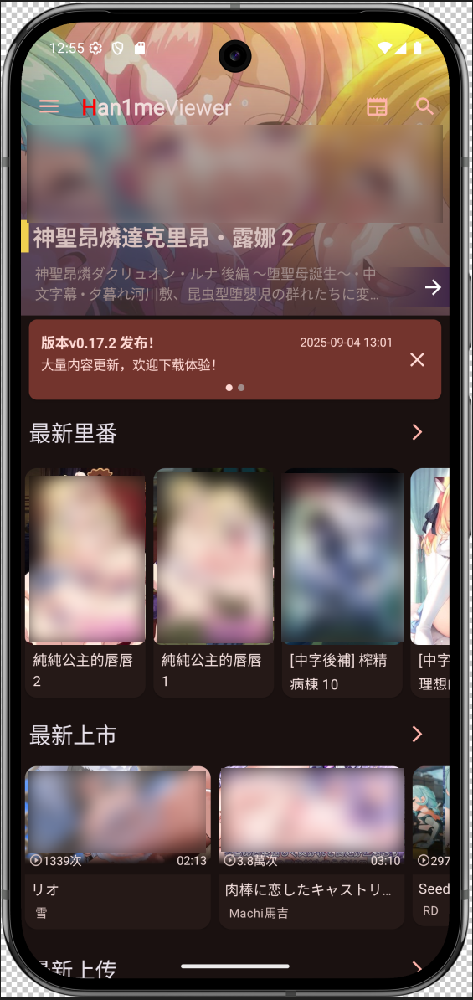
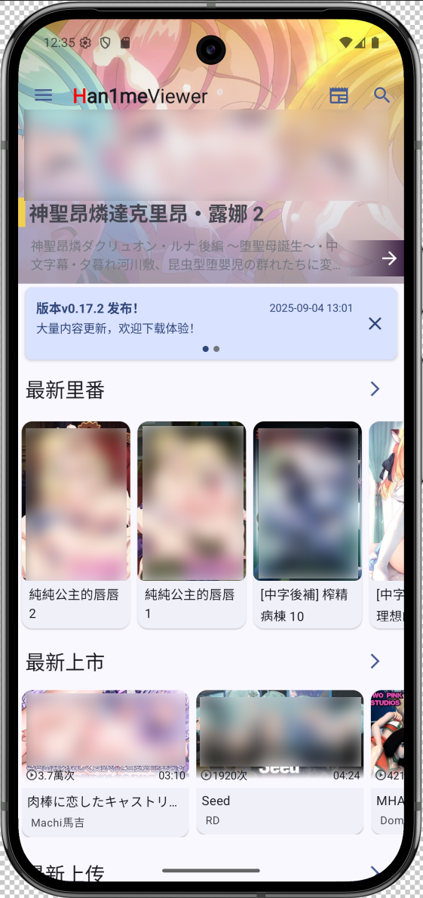
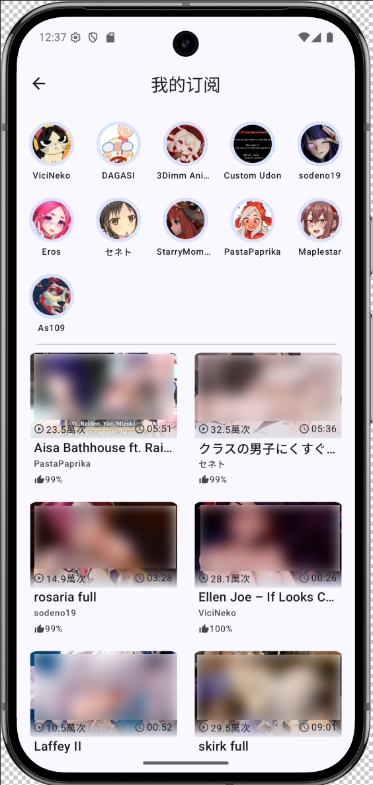
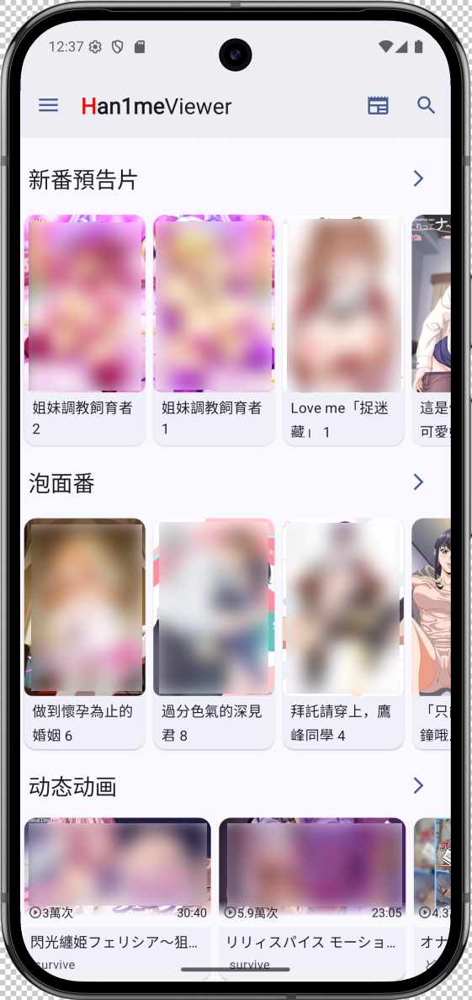
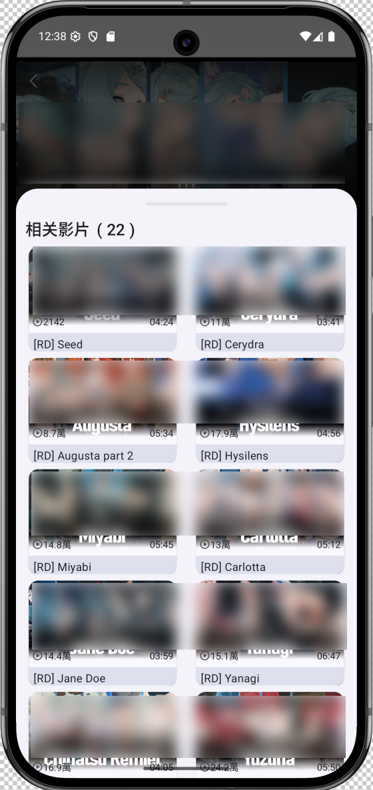

# <font color='red'>🚫请不要在任何公开平台宣传本软件，本软件不接受任何形式的公开宣传，否则仓库主将随时归档隐藏该仓库并删除已编译的发行版🚫</font>
# 本应用没有任何官方网站，仅Github Release、CI持续构建产物为唯一下载及更新渠道
# Han1meViewer
🔞R18警告,未满18岁禁止下载使用！\
Han1meViewer 是一个基于 Kotlin 开发的 Android 应用，用于播放和浏览 hanime 视频资源，支持双栏与单栏布局切换、ExoPlayer 自定义播放内核、系列视频导航、播放列表和推荐内容展示等功能。

## 📜 项目来源与许可声明

此项目最初 Fork 自 [YenalyLiew/Han1meViewer](https://github.com/YenalyLiew/Han1meViewer)，感谢原作者的贡献。原项目采用 [Apache License 2.0](https://www.apache.org/licenses/LICENSE-2.0)。

根据 Apache 2.0 许可证要求：
- 保留原版权声明
- 包含许可证文件副本
- 说明修改内容（如有）

**原始仓库**: [YenalyLiew/Han1meViewer](https://github.com/YenalyLiew/Han1meViewer)  
**许可证文件**: [本项目 LICENSE 文件](LICENSE)

---
# 📜 免责声明

本应用程序（以下简称"本应用"）与 `https://hanime1.me/` 及其关联方无任何隶属、合作或授权关系，特此声明如下：

## 🔍 数据来源
本应用通过合法技术手段（如Jsoup等工具）仅获取目标网站公开显示的DOM结构信息，不涉及：
- 🔒 用户账户等隐私数据
- 🛑 网站后端数据库访问
- ⚠️ 任何形式的注入攻击

## ⚖️ 使用限制
本应用提供的所有内容仅用于：
- 📚 技术研究学习
- ✨ 移动端用户体验优化
- 🚫 非商业用途展示

## ©️ 版权归属
原始视频/图文内容版权均归 `https://hanime1.me/` 或原始视频 制作/发行方 所有，本应用:
- 💾 不存储任何版权内容
- ✂️ 不修改原始内容
- 🏷️ 不声称拥有内容所有权

## 🛡️ 责任豁免
使用者应知晓：
- ⏳ 本应用不保证数据的完整性和实时性
- 🙅‍♂️ 使用产生的一切后果由用户自行承担
- ⛔ 不得用于非法用途

## 📮 权利声明
若`https://hanime1.me/` 认为本应用行为不当，可通过使用Github内建留言等功能联系我们。

---

🔄 最后更新日期：`2025-6-22`  
ℹ️ 温馨提示：建议通过官方渠道支持原站内容，并点击广告以支持网站运营者。

---
## 🧾 参与讨论
 Telegram群组： [https://t.me/Han1meViewer](https://t.me/Han1meViewer)

## ✨ 功能特色
* 🌙 主题系统：支持语义化颜色和莫奈取色，可根据主题模式正确渲染状态栏深浅色
* 💬 评论系统：支持评论排序、举报功能，优化回复体验和子评论展示
* 📁 下载管理：支持自定义下载目录，可导入已下载文件，支持在线加载已下载视频
* 📢 公告功能：内置公告系统，支持公告管理 WEBUI 和隐藏策略
* 🎯 原作漫画：集成原作漫画功能，丰富内容生态
* 🔍 智能搜索：优化搜索结果展示，修复跳页和缺失问题
* 🌐 网络优化：增加 CDN 节点延迟检测，添加备用域名，提高访问质量
* 📊 健康打卡：内置冲了么打卡功能
* 🔐 隐私保护：增加应用锁、图标伪装功能，保护你的隐私
* 🌐 国际化：增加语言设置功能
* 🏷 功能扩充：补齐网站标签和排序方式
* 🦜 保护你的眼睛：添加评论关闭功能
* 📒 功能补充：添加我的订阅界面、画中画模式、手动录入 cookies

## 📷 截图预览
>  
>  
>  
> 
## 🛠️ 技术栈

* Kotlin
* Jetpack Navigation
* ViewModel + StateFlow
* Jetpack Compose
* ExoPlayer
* JZPlayer 自定义接口
* Fragment + ConcatAdapter 多类型布局
* 动态布局比例切换与视图位置交换
* ......

## 🧪 使用说明

### 运行环境

* Android Studio 可靠编译版本：Android Studio Narwhal | 2025.1.1
  Build #AI-251.25410.109.2511.13665796, built on June 19, 2025
* 最低支持 Android 7.0 (API 24 Nougat)
* 目标版本 Android 15 (API 35 V)
* Android Gradle 8.10.0
* Kotlin 2.2.0
* Serialization Plugin 2.0.21
* KSP 2.2.0-2.0.2

### 启动流程

1. 克隆项目：

   ```bash
   git clone https://github.com/misaka10032w/Han1meViewer.git
   ```

2. 使用 Android Studio 打开并同步 Gradle。

3. 编译测试。

### 视频数据说明

* 视频数据通过 `VideoViewModel` 提供，`StateFlow` 形式推送状态；
* `HanimeVideo` 数据结构包含系列、推荐、订阅等字段。


## 🧩 TODO

* [✅] 随时有想法随时写


## 📄 许可证

本项目继承原始项目的 [Apache License 2.0](https://www.apache.org/licenses/LICENSE-2.0)，主要条款包括：
- 允许商用、修改、分发
- 要求保留版权声明和许可证文件
- 提供修改说明（如有）
- 不提供质量担保
- 不承担用户使用风险

完整条款请参阅项目根目录下的 [LICENSE](LICENSE) 文件。

