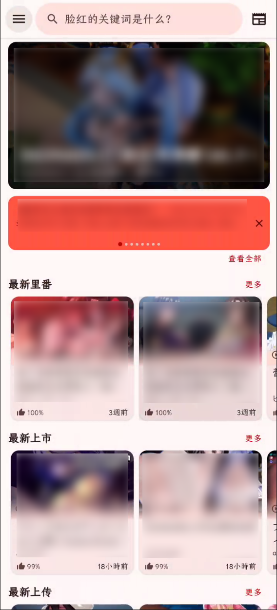
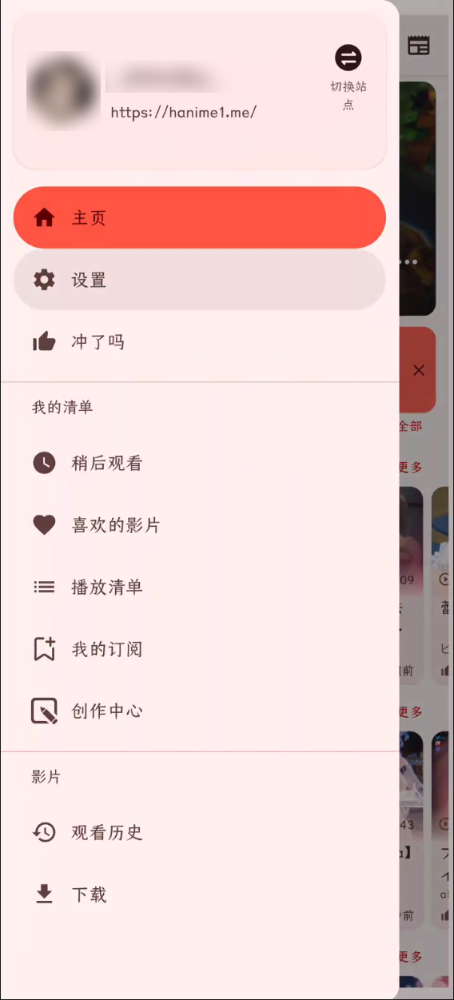
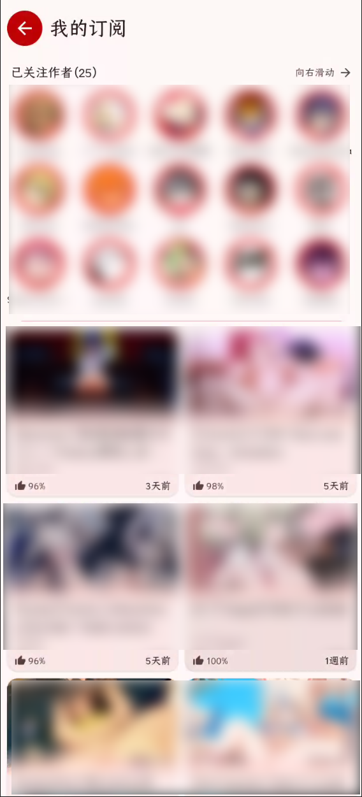
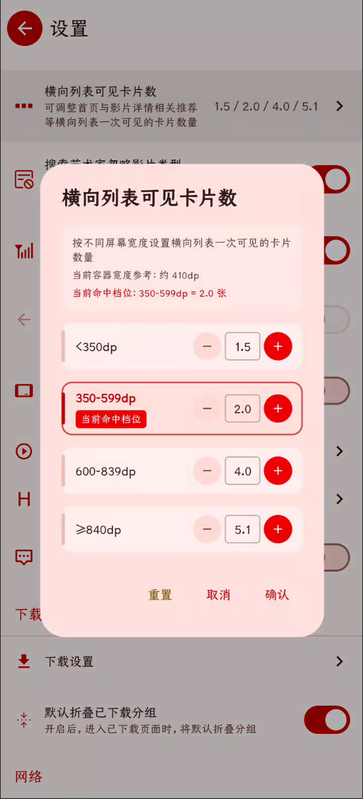
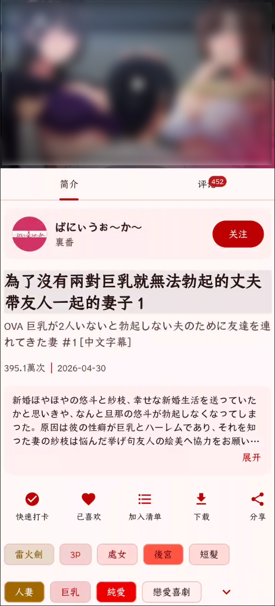
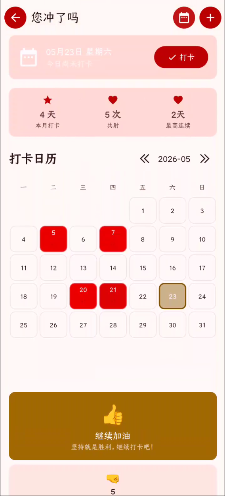

# 🚫 请不要在任何公开平台宣传本软件

本软件不接受任何形式的公开宣传。若出现公开宣传、搬运或引流，仓库维护者可能随时归档或隐藏仓库，并删除已编译的发行版。

# 🌸 Han1meViewer

🔞 R18 警告：未满 18 岁禁止下载和使用。

Han1meViewer 是一个使用 Kotlin 开发的 Android 客户端，用于浏览、搜索、播放和管理 hanime 相关公开视频页面内容。当前项目以 Jetpack Compose、Navigation Compose、ViewModel、StateFlow、Retrofit、Jsoup、Room、WorkManager、Media3/JZVD/MPV 为主要技术栈，围绕视频浏览、详情播放、搜索、用户列表、下载管理、评论、订阅、设置和隐私保护等功能组织。

本应用没有任何官方网站。GitHub Release 与 CI 构建产物是唯一下载及更新渠道。

## 📜 项目来源与许可

此项目最初 Fork 自 [YenalyLiew/Han1meViewer](https://github.com/YenalyLiew/Han1meViewer)，感谢原作者的贡献。原项目采用 [Apache License 2.0](https://www.apache.org/licenses/LICENSE-2.0)。

根据 Apache 2.0 许可证要求：

- 保留原版权声明。
- 包含许可证文件副本。
- 说明修改内容。

原始仓库：[YenalyLiew/Han1meViewer](https://github.com/YenalyLiew/Han1meViewer)

许可证文件：[LICENSE](LICENSE)

## ⚠️ 免责声明

本应用程序与 `https://hanime1.me/` 及其关联方无任何隶属、合作或授权关系。

🔍 数据来源：

- 本应用仅通过常规网络请求和 HTML DOM 解析获取目标网站公开显示的信息。
- 本应用不访问网站后端数据库。
- 本应用不进行注入攻击、绕过授权或获取非公开用户隐私数据。

⚖️ 使用限制：

- 本应用仅用于技术研究、学习交流和移动端体验优化。
- 本应用不提供商业化服务。
- 使用者应自行遵守所在地区法律法规和目标网站规则。

©️ 版权归属：

- 原始视频、图文和相关内容版权归 `https://hanime1.me/` 或原始制作、发行方所有。
- 本应用不存储版权内容，不修改原始内容，不声称拥有内容所有权。

🛡️ 责任豁免：

- 本应用不保证数据完整性、准确性和实时性。
- 使用本应用产生的一切后果由用户自行承担。
- 不得将本应用用于任何非法用途。

若 `https://hanime1.me/` 认为本应用行为不当，可通过 GitHub 仓库内置功能联系维护者。

🔄 最后更新日期：`2026-05-23`

ℹ️ 建议通过官方渠道支持原站内容，并点击广告以支持网站运营者。

## 💬 参与讨论

Telegram 群组：[https://t.me/Han1meViewer](https://t.me/Han1meViewer)

## ✨ 功能概览

- 🏠 首页浏览：支持首页推荐、最新上传、分类入口、预览页和搜索入口。
- 🎬 视频详情：支持简介、作者、标签、系列视频、相关推荐、评论和子评论。
- ▶️ 视频播放：支持在线播放、本地下载文件播放、画中画、播放内核切换、倍速和画质选择。
- 🔍 搜索系统：支持关键词搜索、高级搜索、历史记录、筛选条件展示和分页加载。
- 👤 用户内容：支持收藏、稍后观看、播放列表、在线历史、订阅作者和创作中心。
- 💬 评论系统：支持评论排序、回复查看、举报和复制分享文本。
- 📥 下载管理：支持后台下载、下载分组、导入本地文件、自定义下载目录和下载后播放。
- 🔐 账号能力：支持登录、手动录入 cookies、账号资料、头像裁剪、登录状态检测和退出登录。
- 🎨 主题与设置：支持 Material 3 主题、动态颜色、首页布局、播放设置、MPV 设置、下载设置和网络设置。
- 🕵️ 隐私保护：支持应用锁、启动器图标伪装和手动 Cookie 管理。
- 🌐 网络辅助：支持 Cloudflare 处理、备用域名、代理相关设置、CDN/网络检测和更新检查。
- 📅 健康打卡：内置冲了么打卡页面和桌面小组件。
- 🎯 共享关键 H 帧：支持内置关键帧数据读取、设置和共享数据展示。
- 🗞️ 公告系统：支持首页公告展示、公告详情弹窗，并配套 `HanimeAnnouncementManagerWebUI` 维护 Firebase Realtime Database 中的 `announcements` 节点。

## 🗞️ 公告系统使用须知

公告系统分为两部分：

- 用户侧：应用启动后由 `MainViewModel.loadAnnouncements()` 从 Firebase Realtime Database 读取 `announcements` 节点，首页会展示有效公告，并可点开公告详情弹窗。
- 维护侧：`HanimeAnnouncementManagerWebUI` 用于维护公告数据，负责向同一个 `announcements` 节点写入、更新或下线公告。

`HanimeAnnouncementManagerWebUI` 目录包含两个文件：

- `HanimeAnnouncementManager.html`：公告管理网页，用于增删改查公告、切换启用状态。
- `PermitAdmin.py`：给 Firebase Auth 用户写入 `isAdmin` 自定义声明，用于控制谁能访问管理端。

前置条件：

- 应用必须能够正常访问网络。
- 项目中配置的 Firebase Realtime Database 地址必须可用。
- `announcements` 节点下的公告数据结构需要和 `Announcement` 模型一致，至少包含 `title`、`content`、`isActive` 等字段。
- 公告内容会按 `priority` 排序，只有 `isActive = true` 的公告才会显示。
- 管理端需要启用 Firebase Authentication 和 Realtime Database。
- 管理端需要准备 Firebase Web 配置参数和可登录的管理员邮箱、密码。
- 若使用 `PermitAdmin.py`，还需要 Firebase Admin SDK 的 `serviceAccountKey.json`。

使用规则：

- 首页公告默认会展示为有效公告列表。
- 用户关闭公告后，会记录 `last_dismiss_time`，24 小时内不会再次自动弹出。
- 公告详情支持标题、内容、发布时间、图片和按钮文案。
- 若公告配置了链接，内容中可直接展示可点击的 URL。

管理端使用步骤：

1. 在 `HanimeAnnouncementManager.html` 中填写 `firebaseConfig`。
2. 在 `ADMIN_EMAIL` 和 `ADMIN_PASSWORD` 中填入可登录 Firebase Auth 的管理员账号。
3. 确保 Realtime Database 规则允许该管理员账号读写 `announcements` 节点。
4. 如需批量授权管理员，先安装 `firebase-admin`，准备 `serviceAccountKey.json`，再运行 `PermitAdmin.py` 并填写目标用户 UID。
5. 打开管理页后即可新增、编辑、启用、停用或删除公告。

公告字段说明：

- `title`：公告标题。
- `content`：公告正文。
- `imageUrl`：公告图片地址，可选。
- `positiveText`：确认按钮文案，可选。
- `negativeText`：取消按钮文案，可选。
- `priority`：排序优先级。
- `timestamp`：公告时间戳，单位为秒。
- `isActive`：是否启用。

维护建议：

- 新公告建议先在 WebUI 中预览，再切换为 `isActive = true`。
- 过期或不再需要显示的公告应直接下线，而不是删除，以便回溯。
- 重要公告优先级数值应更高或更低需与 WebUI 约定保持一致，避免排序混乱。

## 📷 截图预览

 

 

 



## 🧱 当前架构

📦 项目采用多模块 Gradle 结构：

- `:app`：主应用模块，包含界面、导航、业务 ViewModel、网络解析、数据库、下载 Worker、播放器和资源文件。
- `:yenaly_libs`：项目内公共基础库，封装通用 Activity、Fragment、ViewModel、偏好设置、工具类和基础组件。
- `buildSrc`：构建配置辅助代码，用于版本号、构建类型和提交信息等 Gradle 逻辑。

🗂️ 主应用采用分层组织：

- `ui.activity`：入口 Activity、登录、Cloudflare 处理和手动 Cookie 输入页面。
- `ui.navigation`：Navigation Compose 路由定义、主导航、设置导航和安全跳转封装。
- `ui.screen`：Compose 页面实现，按首页、搜索、视频、设置、账号、下载等业务域划分。
- `ui.component`：可复用 Compose 组件，如视频卡片、弹窗、空/错/加载状态、AppBar、评论卡片等。
- `ui.viewmodel`：页面状态和业务动作入口，主要通过 `StateFlow` / `SharedFlow` 对 UI 暴露状态。
- `logic.network`：Retrofit Service、OkHttp 拦截器、DNS、CookieJar、更新服务和网络入口。
- `logic.model`：页面和网络解析后的领域模型，如 `HanimeVideo`、`HanimeInfo`、`HomePage`、`Playlists` 等。
- `logic.dao` / `logic.entity`：Room 数据库、DAO 和实体，用于历史、下载、搜索历史、关键帧、打卡等本地数据。
- `announcement` 链路：公告数据从 Firebase Realtime Database 的 `announcements` 节点读取，首页通过 `MainViewModel.loadAnnouncements()` 拉取并展示，管理端使用 `HanimeAnnouncementManagerWebUI` 维护公告内容。
- `worker`：WorkManager 下载任务和更新任务。
- `util`：主题、网络、文件、权限、Cookie、Toast、视频和通用工具方法。

🔁 整体数据流：

```text
Compose Screen -> ViewModel -> NetworkRepo / DatabaseRepo -> Retrofit + Jsoup / Room -> StateFlow -> Compose Screen
```

🎞️ 视频页数据流：

```text
VideoRoute -> VideoViewModel -> NetworkRepo.getHanimeVideo -> Parser -> HanimeVideo -> VideoScreen / Player / CommentScreen
```

📥 下载数据流：

```text
DownloadScreen -> DownloadViewModel -> HanimeDownloadManagerV2 -> WorkManager Worker -> Room -> Flow -> UI
```

## 🛠️ 技术栈

- Kotlin 2.3.x
- Java 21 toolchain
- Android Gradle Plugin 9.2.x
- Jetpack Compose + Material 3
- Navigation Compose + Kotlin Serialization typed routes
- ViewModel + StateFlow + SharedFlow
- Retrofit 3 + kotlinx.serialization converter
- Jsoup HTML 解析
- Room + KSP
- WorkManager 后台任务
- Coil 3 Compose 图片加载
- Media3 ExoPlayer、JZVD、MPV Android
- Firebase Analytics、Crashlytics、Performance、Remote Config、Realtime Database
- AndroidX Window、Biometric、SplashScreen、Preference
- AboutLibraries 开源许可展示

## 🧰 构建环境

✅ 推荐环境：

- Android Studio Panda 或更新版本。
- JDK 21。
- Gradle Wrapper 使用仓库内置版本。
- 编译 SDK：`37`。
- 最低支持：Android 8.1，API `27`。
- 目标 SDK：`37`。

📌 关键版本以仓库文件为准：

- `gradle.properties`
- `gradle/libs.versions.toml`
- `app/build.gradle.kts`
- `buildSrc/src/main/java/Config.kt`

## 🚀 本地运行

1. 克隆项目：

   ```bash
   git clone https://github.com/misaka10032w/Han1meViewer.git
   ```

2. 使用 Android Studio 打开项目根目录。

3. 等待 Gradle Sync 完成。

4. 选择 `debug` 变体运行到设备或模拟器。

💻 常用命令：

```bash
./gradlew :app:compileDebugKotlin
./gradlew :app:assembleDebug
```

🪟 Windows PowerShell：

```powershell
.\gradlew.bat :app:compileDebugKotlin
.\gradlew.bat :app:assembleDebug
```

🔏 Release 构建需要本地或 CI 提供签名相关环境变量：

- `KEYSTORE_PASSWORD`
- `KEY_ALIAS`

🔑 GitHub API Token 可通过环境变量或本地文件提供：

- 环境变量：`HA_GITHUB_TOKEN`
- 本地文件：`app/ha1_github_token.txt`

## ✅ 代码约定

- UI 优先使用 Jetpack Compose，少量历史页面和组件仍保留 XML / ViewBinding / DataBinding。
- 页面状态通过 `StateFlow` 暴露，事件通过 `SharedFlow` 或回调传递。
- 网络页面列表追加时应按稳定业务键去重，避免 Compose `Lazy*` 列表 key 冲突。
- `LazyColumn`、`LazyVerticalGrid`、`LazyRow` 使用稳定 key 时应确保数据源唯一。

## 🗺️ 目录速查

```text
Han1meViewer/
├── app/                         主 Android 应用
│   ├── src/main/java/.../logic   网络、解析、模型、数据库、状态
│   ├── src/main/java/.../ui      Activity、Compose 页面、导航、组件、ViewModel
│   ├── src/main/java/.../util    通用工具
│   ├── src/main/java/.../worker  WorkManager 任务
│   └── src/main/res              资源文件、主题、布局、图标、小组件
├── yenaly_libs/                  项目内公共库
├── buildSrc/                     Gradle 构建辅助代码
├── gradle/libs.versions.toml     依赖版本目录
├── README.md                     项目说明
└── README_TECH.md                历史技术说明与部分实现笔记
```

## 🤝 贡献说明

- 提交代码前请先确认可以通过 `:app:compileDebugKotlin`。
- 修改网络列表、分页或 Compose `Lazy*` 列表时，请检查重复 key 风险。
- 修改播放、下载、账号、Cookie、Cloudflare、更新逻辑时，请尽量说明验证方式。
- 提交共享关键 H 帧可参考 `.github/PULL_REQUEST_TEMPLATE/submit_h_keyframe.md`。

## 🧩 TODO

- 随时有想法随时写。

## 📄 许可证

本项目继承原始项目的 [Apache License 2.0](https://www.apache.org/licenses/LICENSE-2.0)。主要条款包括：

- 允许商用、修改和分发。
- 要求保留版权声明和许可证文件。
- 要求提供修改说明。
- 不提供质量担保。
- 不承担用户使用风险。

完整条款请参阅项目根目录下的 [LICENSE](LICENSE) 文件。
